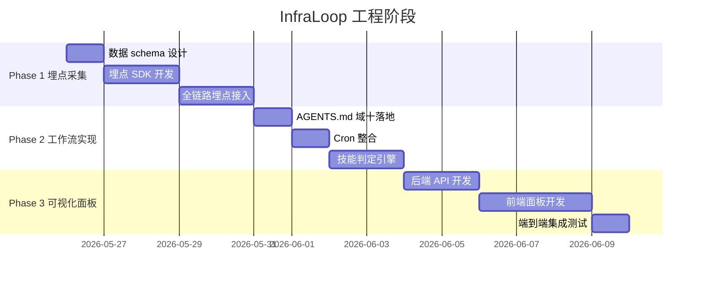
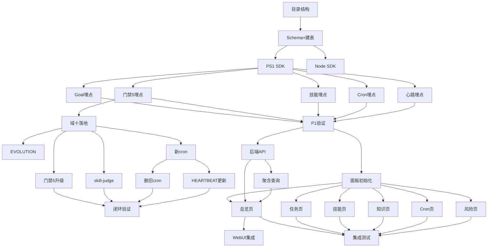

# 🏗️ 基础设施工作流大循环 — 工程任务地图

> 项目代号: **InfraLoop**
> 规划日期: 2026-05-26
> 规划工具: task-planner v1.0.0
> 上游设计: `design/infrastructure-workflow-v1.md`

---

## 📋 项目概览

| 项目 | 说明 |
|------|------|
| **目标** | 构建「执行→沉淀→技能化→触发」闭环，配套全链路数据采集与可视化面板 |
| **约束** | Windows 环境、Agent 集群不停机、不破坏现有技能和 cron |
| **时间线** | 不限死线，按 Phase 顺序推进 |

---

## 🗺️ 阶段总览



---

## 🎯 里程碑

| M# | 阶段 | 里程碑 | 验收标准 |
|-----|------|--------|---------|
| M1 | P1 | 埋点数据开始积累 | `analytics/metrics.db` 有 ≥100 条记录，≥3 种事件类型 |
| M2 | P1 | 埋点覆盖全链路 | 4 个节点（Goal Harness/门禁5/技能化/技能触发）各有 event 产出 |
| M3 | P2 | 域十生效 | 下次门禁 5 后自动执行技能化判定 |
| M4 | P2 | Cron 整合完成 | 5 个 cron + 1 HEARTBEAT，旧 cron 已删除 |
| M5 | P2 | 判定引擎首次实战 | 一次真实任务后判定产出结果 |
| M6 | P3 | 面板可访问 | 浏览器打开面板，看到实时数据 |
| M7 | P3 | 端到端闭环 | 面板展示完整循环数据（执行→沉淀→技能→触发） |

---

## 📐 阶段一：埋点采集（Instrumentation）

### 背景

当前系统有执行行为但无结构化数据记录。所有决策依赖会话笔记（人读）和 cron log（非结构化），无法做量化分析。

### 目标

在 InfraLoop 的每个关键节点插入数据采集点，将所有执行事件写入结构化数据库，为 Phase 3 的可视化面板提供原始数据。

### 埋点架构

```
┌──────────────────────────────────────────────────┐
│                InfraLoop Telemetry                │
│                                                  │
│  ┌────────┐  ┌────────┐  ┌────────┐  ┌────────┐ │
│  │Goal    │  │门禁5   │  │技能化  │  │技能触发│ │
│  │Harness │  │沉淀    │  │判定    │  │执行    │ │
│  └───┬────┘  └───┬────┘  └───┬────┘  └───┬────┘ │
│      │ event     │ event     │ event     │ event  │
│      ▼           ▼           ▼           ▼        │
│  ┌──────────────────────────────────────────┐    │
│  │         Telemetry SDK (PS1 + Node)         │    │
│  │  track(event_type, payload) → SQLite       │    │
│  └──────────────────┬───────────────────────┘    │
│                     │                             │
│                     ▼                             │
│  ┌──────────────────────────────────────────┐    │
│  │  ~/.openclaw/analytics/metrics.db         │    │
│  │  ├─ events          (核心事件流)          │    │
│  │  ├─ task_runs       (任务执行记录)        │    │
│  │  ├─ skill_calls     (技能触发记录)        │    │
│  │  ├─ gate5_log       (知识沉淀记录)        │    │
│  │  ├─ cron_runs       (cron 执行记录)       │    │
│  │  └─ system_health   (系统健康快照)        │    │
│  └──────────────────────────────────────────┘    │
└──────────────────────────────────────────────────┘
```

### 数据 Schema

#### 1. events（核心事件流）

| 字段 | 类型 | 说明 |
|------|------|------|
| id | INTEGER PK | 自增 |
| timestamp | TEXT | ISO 8601 |
| event_type | TEXT | 事件类型枚举 |
| source | TEXT | 来源组件 |
| session_id | TEXT | 所属会话 |
| payload_json | TEXT | JSON 负载 |
| duration_ms | INTEGER | 耗时（如适用） |
| status | TEXT | success / failure / skipped |

**事件类型枚举**：
```
task.created          — 任务创建
task.phase_start      — 进入某阶段
task.phase_complete   — 完成某阶段
task.complete         — 任务完成
task.fail             — 任务失败
subagent.spawn        — 子代理启动
subagent.complete     — 子代理完成
subagent.fail         — 子代理失败
gate5.memory_store    — 写入一条向量记忆
gate5.backlink        — 建立一条内链
gate5.memory_append   — MEMORY.md 追加
gate5.complete        — 门禁 5 完成
skill.judge           — 技能化判定（含评分）
skill.create          — 创建新技能
skill.patch           — 追加补丁
skill.trigger         — 技能被触发加载
skill.execute         — 技能执行
skill.fail            — 技能执行失败
cron.start            — Cron 开始
cron.complete         — Cron 完成
cron.fail             — Cron 失败
system.health         — 系统健康快照
```

#### 2. task_runs（任务执行记录）

| 字段 | 类型 | 说明 |
|------|------|------|
| task_id | TEXT PK | 唯一任务 ID |
| project_name | TEXT | 项目名 |
| goal | TEXT | 任务目标 |
| phases_count | INTEGER | 阶段数 |
| subagents_count | INTEGER | 子代理数 |
| tool_calls_count | INTEGER | 工具调用次数 |
| total_duration_ms | INTEGER | 总耗时 |
| status | TEXT | 最终状态 |
| gate5_decision | INTEGER | 判定分数 |
| skill_created | TEXT | 创建的技能名（如有） |

#### 3. skill_calls（技能触发记录）

| 字段 | 类型 | 说明 |
|------|------|------|
| id | INTEGER PK | 自增 |
| timestamp | TEXT | ISO 8601 |
| skill_name | TEXT | 技能名 |
| trigger_method | TEXT | 如何触发（vector / manual / cron） |
| session_id | TEXT | 触发会话 |
| result | TEXT | 执行结果 |
| duration_ms | INTEGER | 耗时 |

#### 4. gate5_log（知识沉淀记录）

| 字段 | 类型 | 说明 |
|------|------|------|
| session_id | TEXT | 会话 |
| timestamp | TEXT | 时间 |
| memory_stores | INTEGER | 写入向量条数 |
| backlinks | INTEGER | 建立内链数 |
| memory_appends | INTEGER | MEMORY.md 追加数 |
| decisions | TEXT | 关键决策摘要 |

#### 5. cron_runs（Cron 执行记录）

| 字段 | 类型 | 说明 |
|------|------|------|
| cron_name | TEXT | Cron 名称 |
| timestamp | TEXT | 执行时间 |
| duration_ms | INTEGER | 耗时 |
| status | TEXT | 状态 |
| error | TEXT | 错误信息（如有） |

#### 6. system_health（系统健康快照）

| 字段 | 类型 | 说明 |
|------|------|------|
| timestamp | TEXT | ISO 8601 |
| agents_md_kb | REAL | AGENTS.md 大小 |
| memory_md_kb | REAL | MEMORY.md 大小 |
| heartbeat_md_kb | REAL | HEARTBEAT.md 大小 |
| sessions_notes_count | INTEGER | 笔记文件数 |
| vector_store_items | INTEGER | 向量库条目数 |
| skills_count | INTEGER | 技能总数 |
| crons_enabled | INTEGER | 活跃 cron 数 |
| gateway_uptime_h | REAL | gateway 运行时长 |

---

### 任务分解

| ID | 任务 | 阶段 | 描述 | 工时 | 依赖 | 优先级 |
|----|------|------|------|------|------|--------|
| T1 | 创建 analytics 目录结构 | P1 | `analytics/`, `analytics/schema/`, `analytics/sdk/`, `analytics/logs/` | 0.2h | - | P0 |
| T2 | 设计 SQLite schema + 建表脚本 | P1 | 6 张表 DDL + `init-db.ps1` | 0.5h | T1 | P0 |
| T3 | 开发 Telemetry SDK (PS1) | P1 | `track-event.ps1` — 单个事件写入；`track-batch.ps1` — 批量写入 | 1h | T2 | P0 |
| T4 | 开发 Telemetry SDK (Node) | P1 | `tracker.mjs` — 供 Node 侧直接调用 better-sqlite3 | 1h | T2 | P1 |
| T5 | Goal Harness 埋点接入 | P1 | task-planner / openclaw-superpowers / longtask-orchestrator 中插入 track-event 调用 | 1.5h | T3 | P0 |
| T6 | 门禁 5 埋点接入 | P1 | AGENTS.md 门禁 5 操作手册中追加埋点步骤 | 0.5h | T3 | P0 |
| T7 | 技能创建埋点接入 | P1 | skill-creator + skill-judge 中追加埋点 | 0.5h | T3 | P0 |
| T8 | Cron 埋点接入 | P1 | 5 个 cron 的 brief 中追加埋点调用 | 0.5h | T3 | P1 |
| T9 | HEARTBEAT 健康快照埋点 | P1 | HEARTBEAT.md 追加 system_health 采集逻辑 | 0.5h | T3 | P1 |
| T10 | 埋点端到端验证 | P1 | 手动触发一轮，检查 6 张表均有数据 | 0.5h | T5,T6,T7,T8,T9 | P0 |

---

## 📐 阶段二：工作流实现

| ID | 任务 | 阶段 | 描述 | 工时 | 依赖 | 优先级 |
|----|------|------|------|------|------|--------|
| T11 | AGENTS.md 新增域十 | P2 | 写入工作流大循环定义+强制规则+cron调度表 | 0.3h | T6 | P0 |
| T12 | EVOLUTION.md 更新 | P2 | 追加工作流循环状态表 + 修订架构描述 | 0.2h | T11 | P1 |
| T13 | 创建 skill-judge 技能 | P2 | 实现四级评分矩阵判定引擎 | 1h | T11 | P0 |
| T14 | 门禁 5 操作手册升级 | P2 | 追加三要素验收检查清单 | 0.3h | T11 | P0 |
| T15 | 创建 5 个新 cron | P2 | daily-pipeline / weekly-housekeeping / memory-reindex-weekly / daily-health-silent / gateway-health-daily（更新） | 1h | T11 | P0 |
| T16 | 删除被合并的旧 cron | P2 | 12 个旧 cron 删除 | 0.3h | T15 | P0 |
| T17 | HEARTBEAT.md 更新 | P2 | 移除被迁移的检查项，保留剩余项 | 0.3h | T15 | P0 |
| T18 | 端到端闭环验证 | P2 | 跑一轮完整循环：任务→门禁5→判定→技能创建（或追加） | 1h | T13,T14,T15 | P0 |

---

## 📐 阶段三：可视化面板

### 面板设计

```
┌─────────────────────────────────────────────────────────┐
│  🏗️ InfraLoop Dashboard                    [刷新] [导出] │
├────────────┬────────────────────────────────────────────┤
│            │                                            │
│  📊 全局   │  ┌──────────┐ ┌──────────┐ ┌───────────┐  │
│  概览      │  │循环轮次   │ │活跃技能  │ │知识条目    │  │
│            │  │   12      │ │   34     │ │   1,247    │  │
│            │  └──────────┘ └──────────┘ └───────────┘  │
│            │  ┌──────────┐ ┌──────────┐ ┌───────────┐  │
│            │  │成功率     │ │平均耗时  │ │向量覆盖率  │  │
│  📈 任务   │  │  94.2%    │ │  3.2m    │ │  88.3%     │  │
│  执行      │  └──────────┘ └──────────┘ └───────────┘  │
│            │                                            │
│  🛠️ 技能   │  [任务执行时间线——折线图]                    │
│  生命周期   │  ▓▓▓▓▓▓▓▓▓▓░░░░░░░░                      │
│            │                                            │
│  📚 知识   │  [技能触发频率——柱状图]                      │
│  沉淀      │  ▓▓▓▓▓▓░░░░░░░░░                          │
│            │                                            │
│  ⏰ Cron   │  [知识增长曲线——面积图]                      │
│  健康       │  ░░░░▓▓▓▓▓▓▓▓▓▓                          │
│            │                                            │
│  ⚠️ 风险   │  [Cron 成功率——热力图]                       │
│  告警      │  ▓▓▓▓▓▓▓░░░░░░░                          │
│            │                                            │
├────────────┴────────────────────────────────────────────┤
│  ⚠️ 最近异常: gateway-health-daily 连续失败 2 次 [详情]   │
└─────────────────────────────────────────────────────────┘
```

### 页面路由

| 路由 | 页面 | 内容 |
|------|------|------|
| `/` | 总览仪表盘 | KPI 卡片 + 最近活动时间线 |
| `/tasks` | 任务执行 | 历史任务列表、成功率趋势、耗时分布 |
| `/skills` | 技能生命周期 | 技能列表、触发频率热力图、判定评分分布 |
| `/knowledge` | 知识沉淀 | 向量库增长曲线、内链网络图、MEMORY.md 变化 |
| `/cron` | Cron 健康 | 每个 cron 的成功率、耗时、最近异常 |
| `/risks` | 风险告警 | 异常事件列表、系统健康趋势、预警阈值配置 |
| `/events` | 原始事件流 | 可过滤、可搜索的事件日志 |

---

### 任务分解

| ID | 任务 | 阶段 | 描述 | 工时 | 依赖 | 优先级 |
|----|------|------|------|------|------|--------|
| T19 | 面板技术选型 + 项目初始化 | P3 | Vite + React + Tailwind + Recharts，项目搭建 | 0.5h | T10 | P0 |
| T20 | 后端 API — SQLite 查询服务 | P3 | Express or Bun server，6 个 REST endpoint 对应 6 张表 | 1.5h | T10 | P0 |
| T21 | 后端 API — 聚合查询 | P3 | KPI 汇总、趋势计算、异常检测 | 1h | T20 | P0 |
| T22 | 前端 — 总览仪表盘 | P3 | KPI 卡片 + 最近活动时间线 | 1h | T19,T20 | P0 |
| T23 | 前端 — 任务执行页 | P3 | 历史任务列表 + 成功率趋势图 + 耗时分布图 | 1h | T19 | P1 |
| T24 | 前端 — 技能生命周期页 | P3 | 技能列表 + 触发频率图 + 判定评分分布 | 1h | T19 | P1 |
| T25 | 前端 — 知识沉淀页 | P3 | 向量增长曲线 + 内链统计 + MEMORY 变化 | 0.5h | T19 | P2 |
| T26 | 前端 — Cron 健康页 | P3 | 每个 cron 的独立状态卡片 + 最近异常 | 0.5h | T19 | P1 |
| T27 | 前端 — 风险告警页 | P3 | 异常事件表 + 系统健康趋势 | 0.5h | T19 | P2 |
| T28 | OpenClaw WebUI 集成 | P3 | 面板部署到 Control UI /__openclaw__/canvas/documents/ 下 | 0.5h | T22 | P0 |
| T29 | 端到端集成测试 | P3 | 从埋点到面板全链路验证，人工制造异常事件 | 1h | T28 | P0 |

---

## 🔗 依赖关系图



---

## 📊 资源估算

| 阶段 | 任务数 | 预估总工时 | 关键路径 |
|------|--------|-----------|---------|
| P1 埋点 | 10 | 6.7h | T1→T2→T3→T5→T10 |
| P2 工作流 | 8 | 4.4h | T11→T13+T14→T18 |
| P3 面板 | 11 | 9.0h | T19+T20→T22→T28→T29 |
| **总计** | **29** | **20.1h** | — |

---

## ✅ 验收检查清单

### P1 验收
- [ ] `analytics/metrics.db` 存在且 ≥6 张表
- [ ] `track-event.ps1 "test" '{"msg":"hello"}'` 可执行
- [ ] 手动完成一轮任务后，events 表 ≥20 条记录
- [ ] Goal Harness / 门禁5 / 技能化 / 技能触发 四个节点的 event 均有产出

### P2 验收
- [ ] AGENTS.md 存在域十章节
- [ ] `skill-read skill-judge` 可加载判定引擎
- [ ] 5 个新 cron 在 `cron list` 中出现
- [ ] 旧 12 个 cron 已不可见
- [ ] HEARTBEAT 执行不报错
- [ ] 一次完整循环验证通过

### P3 验收
- [ ] 浏览器打开面板，7 个页面均可访问
- [ ] KPI 卡片显示真实数据
- [ ] 图表可交互（hover 查看详情）
- [ ] 异常事件在告警页可见
- [ ] 面板集成到 OpenClaw WebUI

---

## ⚠️ 风险与对策

| 风险 | 概率 | 影响 | 对策 |
|------|------|------|------|
| SQLite 并发写入冲突（多 agent） | 中 | 中 | 使用 WAL 模式 + 重试逻辑 |
| 埋点代码量膨胀 AGENTS.md | 高 | 低 | 埋点调用仅 1 行 `track-event.ps1`，不写逻辑 |
| 面板开发工时超出预估 | 中 | 低 | OpenCode 编码委托，前端优先 tsc 零报错 |
| 面板数据为空（埋点未触发） | 低 | 高 | P1 端到端验证必须通过才进 P2 |
| 旧 cron 删除误伤 | 低 | 高 | 先 disable 观察 1 天再删除 |
